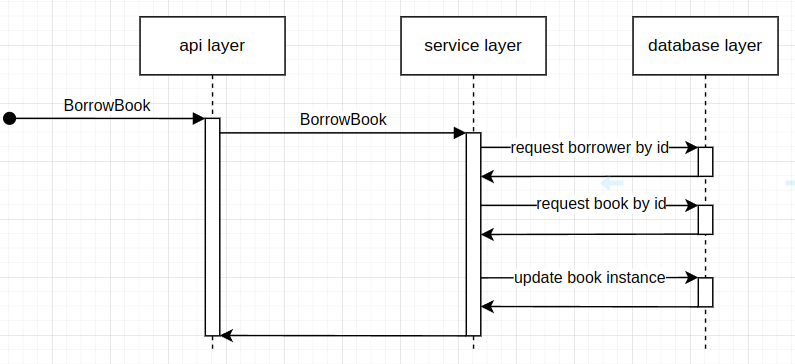

# Runtime View

## Borrow Book

The borrow book interaction enables registered users to check out physical book copies from the library system. This represents a key business transaction with specific quality attribute requirements.

